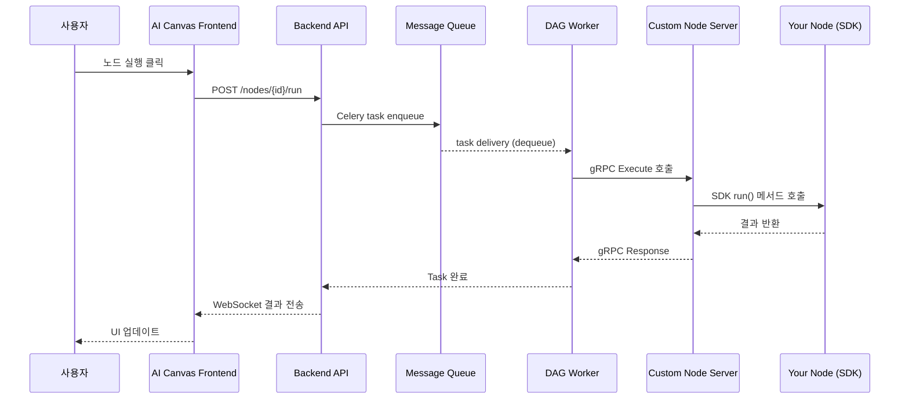

# 시스템 아키텍처

AI Canvas Custom Node SDK의 전체 시스템 아키텍처와 데이터 흐름을 설명합니다.

## 전체 시스템 구조

```
┌─────────────────┐   HTTP/WebSocket  ┌────────────────┐
│   AI Canvas     │◄─────────────────►│   Frontend     │
│ Backend(FastAPI)│                   │                │
└───────┬─────────┘                   └────────────────┘
        │ Celery Task
        ▼
┌─────────────────┐   Task Queue       ┌─────────────────┐
│   Message       │◄─────────────────┬─│   DAG Worker    │
│   Queue(Redis)  │                  │ │   (Celery)      │
└─────────────────┘                  │ └─────────┬───────┘
                                     │           │ gRPC Call
                                     │           ▼
┌─────────────────┐   Results        │ ┌─────────────────┐
│   MongoDB       │◄─────────────────┘ │  Custom Node    │
│   (Data Store)  │                    │   Server        │
└─────────────────┘                    └─────────┬───────┘
                                                 │ SDK Interface
                                                 ▼
                                       ┌─────────────────┐
                                       │   Your Custom   │
                                       │   Node (SDK)    │
                                       └─────────────────┘
```

## 데이터 플로우

### 1. 노드 실행 요청 흐름

```
사용자 액션 → Frontend → Backend → DAG → gRPC → Custom Node → SDK
                                                            ↓
             결과 저장 ← MongoDB ← Results ← Response ← Your Logic
```

### 2. 상세 실행 단계



## gRPC 통신 구조

### Protocol Buffers 스키마

```protobuf
syntax = "proto3";

service CustomNodeExecutor {
  // 단일 노드 실행
  rpc ExecuteNode(NodeRequest) returns (NodeResponse);
  
  // 스트리밍 실행 (대용량 데이터)
  rpc ExecuteNodeStream(NodeRequest) returns (stream NodeProgress);
  
  // 노드 등록 및 검증
  rpc RegisterNode(NodeDefinition) returns (RegistrationResult);
  
  // 헬스체크
  rpc HealthCheck(HealthRequest) returns (HealthResponse);
}

message NodeRequest {
  string node_id = 1;
  string node_type = 2;
  repeated PortData inputs = 3;
  map<string, Value> parameters = 4;
  ExecutionContext context = 5;
}

message NodeResponse {
  repeated PortData outputs = 1;
  ExecutionStatus status = 2;
  string error_message = 3;
  ExecutionMetrics metrics = 4;
}
```

### 데이터 직렬화 계층

```
┌─────────────────────────────────────────┐
│              Application Layer          │
│  (pandas DataFrame, ML Models, etc.)    │
└─────────────┬───────────────────────────┘
              │ SDK Serialization
              ▼
┌─────────────────────────────────────────┐
│           Serialization Layer           │
│  (Parquet, Arrow, Pickle, JSON)         │
└─────────────┬───────────────────────────┘
              │ Protocol Buffers
              ▼
┌─────────────────────────────────────────┐
│             Transport Layer             │
│          (gRPC over HTTP/2)             │
└─────────────────────────────────────────┘
```

## 보안 및 격리

### 1. 코드 격리

```
┌─────────────────┐    ┌─────────────────┐    ┌─────────────────┐
│   AI Canvas     │    │  Custom Node    │    │   Customer      │
│   Core System   │    │   Server        │    │   Code          │
│                 │    │   (gRPC API)    │    │   (SDK)         │
│ • Backend       │    │                 │    │                 │
│ • DAG Worker    │◄──►│ • Interface     │◄──►│ • Your Logic    │
│ • Database      │    │ • Validation    │    │ • Business      │
│ • Core Logic    │    │ • Sandboxing    │    │   Rules         │
│                 │    │ • Monitoring    │    │                 │
└─────────────────┘    └─────────────────┘    └─────────────────┘
     코어 시스템              중간 계층            고객 코드
     (비공개)              (인터페이스)          (격리됨)
```

### 2. 실행 환경 격리

```python
# Custom Node Server에서의 실행 환경 예시
class NodeExecutionEnvironment:
    def __init__(self):
        self.memory_limit = "2GB"
        self.cpu_limit = "1 Core"
        self.timeout = 300  # 5분
        self.network_policy = "restricted"
    
    def execute_node(self, node_code, inputs, parameters):
        # Docker 컨테이너 내에서 실행
        # 리소스 제한 적용
        # 네트워크 접근 제한
        pass
```

## 데이터 처리 최적화

### 1. 데이터 크기별 처리 전략

```python
def choose_serialization_strategy(data_size_mb: float, requires_global_view: bool = False) -> str:
    """데이터/연산 특성에 따른 직렬화·처리 전략 선택

    - requires_global_view: 전체 데이터를 본 뒤에만 정확한 결과가 가능한 연산 여부
      (정확한 전체 정렬/랭킹, 정확 중복 제거, 전구간 백분위, 윈도우 전역 통계, 다중 입력 조인 등)
    """

    # 연산 요구사항이 크기 규칙보다 우선
    if requires_global_view:
        return "batch"      # 공유 볼륨에 전체 물리화 후 배치 처리(두 단계)

    if data_size_mb < 1:
        return "json"       # 작은 데이터는 JSON
    elif data_size_mb < 10:
        return "parquet"    # 중간 데이터는 Parquet
    else:
        return "streaming"  # 대용량은 스트리밍(가능한 경우)
```

### 2. 스트리밍 처리 구조

```
대용량 DataFrame (100MB+)
        │
        ▼
┌─────────────────┐    ┌─────────────────┐    ┌─────────────────┐
│   Chunk 1       │───►│   Process       │───►│   Result 1      │
│   (10MB)        │    │   (Your Logic)  │    │                 │
└─────────────────┘    └─────────────────┘    └─────────────────┘
        │                       │                       │
        ▼                       ▼                       ▼
┌─────────────────┐    ┌─────────────────┐    ┌─────────────────┐
│   Chunk 2       │───►│   Process       │───►│   Result 2      │
│   (10MB)        │    │   (Your Logic)  │    │                 │
└─────────────────┘    └─────────────────┘    └─────────────────┘
        │                                              │
        ▼                                              ▼
      ...                                        Final Result
                                                (Concatenated)
```

### 3. 전체 스캔/배치 처리 (스트리밍 부적합 케이스)

다음과 같은 연산은 청크 단위 스트리밍만으로는 정확 결과를 보장하기 어렵습니다.

- 전체 정렬/랭킹, 정확 백분위/분위수, 전역 윈도우 통계(전 범위 상호 의존)
- 정확 중복 제거/고유값 세기(근사 아님), 전역 키 제약 검증
- 다중 입력 간 정확 조인/세트 연산(교집합/차집합) 전량 기준

권장 처리 패턴(공유 볼륨 전제):

1) 1단계 스캔(프로파일/인덱싱)
- 입력을 Parquet로 전량 물리화(`/data/{canvas}/{node}/{run}/input.parquet`) 후, 전처리 스캔으로 메타·인덱스/버킷 생성
- 예: 소트/조인 키에 대한 외부 정렬용 인덱스, 통계(최소/최대/히스토그램), 유효성 검사 리포트

2) 2단계 배치 처리(외부 메모리 알고리즘)
- 외부 정렬/머지 조인 등으로 전체 정확 연산 수행, 중간 산출물은 임시 파일로 관리 후 rename 커밋

3) 메모리 제약 하 최적화
- 청크 스캔은 유지하되 전역 상태를 파일로 축적(런 길이, 인덱스, 블룸/딕셔너리 파일 등)

간단 예시(두 단계 처리 스켈레톤):

```python
from pathlib import Path
import pandas as pd

DATA_ROOT = Path("/data/{canvas}/{node}/{run}")

def profile_phase(input_paths: list[Path]) -> Path:
    index_path = DATA_ROOT / "index" / "sort_keys.parquet"
    index_path.parent.mkdir(parents=True, exist_ok=True)
    parts = []
    for p in input_paths:
        df = pd.read_parquet(p, columns=["key", "row_ptr"])
        parts.append(df.sort_values("key"))
    pd.concat(parts, ignore_index=True).to_parquet(index_path)
    return index_path

def batch_phase(index_path: Path, input_paths: list[Path]) -> Path:
    output = DATA_ROOT / "result" / "output.parquet.tmp"
    output.parent.mkdir(parents=True, exist_ok=True)
    # 외부 머지 기반 전역 처리 (의사코드)
    # merge_iter = external_merge(index_path, input_paths)
    # for batch in merge_iter:
    #     process(batch)
    #     append_to_parquet(output, batch)
    final = output.with_suffix("")
    output.rename(final)
    return final
```

운영 가이드:
- NodeContext.progress로 단계별 진행률 보고(스캔 → 정렬/조인 → 산출/커밋)
- 실패 시 임시 산출물 정리, 부분 결과는 커밋 전까지 노출 금지
- 리소스 한도(memory/cpu/timeouts)는 배치 2단계가 더 크므로 상향 설정 고려

## 성능 최적화 포인트

### 1. 메모리 관리

```python
# 효율적인 메모리 사용 패턴
class EfficientNode(CustomNode):
    def execute(self, inputs, parameters):
        # 나쁜 예: 전체 데이터를 복사
        # df_copy = inputs['data'].copy()
        
        # 좋은 예: 필요한 부분만 처리
        df = inputs['data']
        result = df.loc[df['value'] > threshold, ['col1', 'col2']]
        
        return {'output': result}
```

### 2. I/O 최적화

```python
# 직렬화 성능 비교 (100만 행 DataFrame 기준)
serialization_performance = {
    'json': {
        'size': '95MB',
        'serialize_time': '2.1s',
        'deserialize_time': '3.2s'
    },
    'parquet': {
        'size': '12MB',       # 8배 압축!
        'serialize_time': '0.3s',
        'deserialize_time': '0.2s'
    },
    'arrow': {
        'size': '35MB',
        'serialize_time': '0.05s',  # 40배 빠름!
        'deserialize_time': '0.03s'
    }
}
```


## 실행 상태 관리

### 상태 전이도

```
[PENDING] ──► [RUNNING] ──► [SUCCESS]
    │             │             
    │             ▼             
    └───────► [FAILED] ◄── [TIMEOUT]
                  │
                  ▼
               [RETRY]
```

### 상태 모니터링

```python
class NodeExecutionStatus:
    PENDING = "pending"
    RUNNING = "running" 
    SUCCESS = "success"
    FAILED = "failed"
    TIMEOUT = "timeout"
    CANCELLED = "cancelled"

class ExecutionMetrics:
    def __init__(self):
        self.start_time = None
        self.end_time = None
        self.memory_peak = None
        self.cpu_usage = None
        self.network_io = None
```

## 모니터링 및 로깅

### 에러 추적

```python
# 구조화된 에러 정보
error_info = {
    'error_type': 'ValidationError',
    'error_message': '필수 컬럼 missing_column이 없습니다',
    'stack_trace': '...',
    'input_schema': {...},
    'execution_context': {
        'node_version': '1.2.0',
        'sdk_version': '2.1.0',
        'python_version': '3.10.12'
    }
}
```

## 확장성 고려사항

### 수평 확장

```
Load Balancer
      │
      ▼
┌─────────────┐    ┌─────────────┐    ┌─────────────┐
│Custom Node  │    │Custom Node  │    │Custom Node  │
│Server 1     │    │Server 2     │    │Server 3     │
└─────────────┘    └─────────────┘    └─────────────┘
```

---

이 아키텍처를 통해 **높은 성능**, **강한 격리**, **쉬운 개발**을 동시에 달성할 수 있습니다.